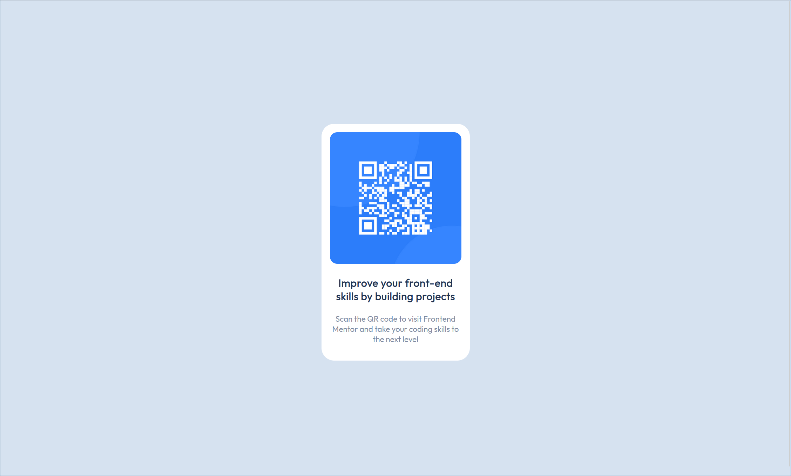

# Frontend Mentor - QR code component solution

This is a solution to the [QR code component challenge on Frontend Mentor](https://www.frontendmentor.io/challenges/qr-code-component-iux_sIO_H).

## Table of contents

- [Frontend Mentor - QR code component solution](#frontend-mentor---qr-code-component-solution)
  - [Table of contents](#table-of-contents)
  - [Overview](#overview)
    - [Screenshot](#screenshot)
  - [My process](#my-process)
    - [Built with](#built-with)
    - [What I learned](#what-i-learned)
    - [Continued development](#continued-development)
    - [Useful resources](#useful-resources)
  - [Author](#author)
  - [Acknowledgments](#acknowledgments)

## Overview

### Screenshot

**Desktop**

**Mobile**

## My process

### Built with

- HTML5
- CSS variables
- CSS Grid
- Mobile-first workflow
- [Google Fonts](https://fonts.google.com/) - For the Font

### What I learned

The basic Idea of Frontend Mentor

### Continued development

Not yet

### Useful resources

No needed

## Author

No links yet :)

## Acknowledgments

Do it step by step.